## Systèmes d'exploitation - Collège de Maisonneuve

---

**Nom :** Cyr

**Prénom :** Jean-Simon

**Groupe :** 25604

**Lien GitHub du devoir** : https://github.com/Jaska28/TP2-Introduction-Reseaux.git

## **Date de remise :** Jeudi 13 février 2026

## Barème récapitulatif

|Section|Points|Note|
|---|---|---|
|Partie 1 : Questions théoriques|20|/20|
|Partie 2 : Commandes réseau|25|/25|
|Partie 3 : Analyse Wireshark|25|/25|
|Partie 4 : Script Bash|30|/30|
|**TOTAL**|**100**|**/100**|

---

# Partie 1 : Questions théoriques (20 points)

## Question 1 - Modèle OSI (5 points)

### a) Complétez le tableau (2.5 pts)

| Protocole/Élément | N° Couche | Nom de la couche |
| ----------------- | --------- | ---------------- |
| HTTP              | 7         | Application      |
| Adresse IP        | 3         | Réseau           |
| Câble Ethernet    | 1         | Physique         |
| TCP               | 4         | Transport        |
| Adresse MAC       | 2         | Liaison          |

### b) Différence entre le modèle OSI et TCP/IP (2.5 pts)

```
Votre réponse : Le modèle OSI à été créer après le TCP/IP. Le OSI a été créer pour être un modèle thoérique universel. Le TCP/Ip comporte 4 couches dont application et accès réseau qui en comprenne 3 et 2 respectivement pour un total de 7 comme le OSI.
```

---

## Question 2 - Adresses IP (5 points)

### a) Adresses privées ou publiques (2.5 pts)

| Adresse IP    | Privée / Publique |
| ------------- | ----------------- |
| 192.168.1.50  | Privée            |
| 8.8.8.8       | Publique (google) |
| 10.0.0.1      | Privé             |
| 172.20.5.100  | Privée            |
| 200.100.50.25 | Publique          |

### b) Qu'est-ce qu'un masque de sous-réseau ? À quoi sert-il ? (2.5 pts)

```
Votre réponse : Le masque de sous-réseau nous dit si une adresse IP est sur le même réseau local ou si on doit passer par un gateway.
```

---

## Question 3 - Protocoles (10 points)

### a) Expliquez le fonctionnement du protocole ARP. Pourquoi est-il nécessaire ? (3 pts)

```
Votre réponse : Protocole qui fait le lien entre les adresses IP et les adresses MAC dans un réseau local. L'ARP garde en mémoire temporairement ces liens et dirige les packets à la bonne machine. Quand un appareil veut communiquer avec un adresse IP, il envoie une requête ARP sur le réseau pour demander c'est quel machine qui a cette adresse. Par la suite, ARP garde en mémoire temporairement l'information pour que les paquets soient envoyés directement.
```

### b) Différence entre une requête DNS de type A et de type AAAA ? (2 pts)

```
Votre réponse : DNS de type A est pour IPv4 et AAAA pour IPv6. IPv6 existe au cas où qu'on manquerait d'adresse IPv4, ce qui va arriver bientôt.
```

### c) Expliquez ce que fait la commande `ping` au niveau du protocole ICMP. Quels types de messages sont échangés ? (3 pts)

```
Votre réponse : Les types de messages de ping sont Echo Request et Echo Reply avec le protocole ICMP pour tester la connectivité. On envoie une requête à l'adresse spécifiée et elle répond si le paquet a été reçu.
```

### d) Sur quel port et avec quel protocole de transport fonctionne DNS par défaut ? Pourquoi ce choix ? (2 pts)

```
Votre réponse : Par défaut, DNS utilise le port 53 avec le protocole UDP. Ce choix permet de gagner en rapidié par rapport au protocole TCP.
```

---

# Partie 2 : Commandes réseau (25 points)

## Exercice 1 : Configuration réseau (10 points)

### a) Configuration réseau

**Commande utilisée :** `ip addr show`

**Adresse IP :** `172.25.53.3`

**Masque de sous-réseau :** Le `/20` correspond à `255.255.240.0` 

**Nom de l'interface réseau principale :** eth0

### b) Passerelle par défaut

**Commande utilisée :**`ip route show`

**Adresse de la passerelle :**`172.25.48.1`

### c) Serveurs DNS

**Commande utilisée :**`nslookup www.google.com`

**Serveurs DNS configurés :**`10.255.255.254`

> 📸 **Capture d'écran 1** : Insérez votre capture montrant la configuration réseau
> 
> 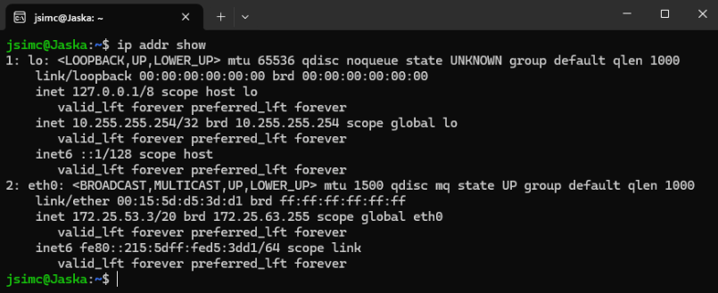
> 
>**Capture 1a – Résultat de la commande   `ip addr show` sous WSL**
>
>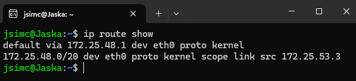
>
>**Capture 1b – Résultat de la commande   `ip route show` sous WSL**
>
>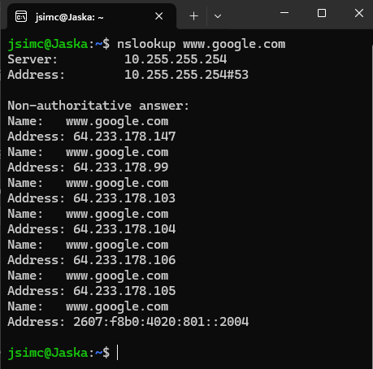
>
>**Capture 1c – Résultat de la commande `nslookup www.google.com` sous WSL**

---

## Exercice 2 : Tests de connectivité avec ping (8 points)

### a) Ping vers localhost (127.0.0.1) - 4 paquets

**Commande exacte utilisée :**`ping -c 4 127.0.0.1`

**Résultat (succès/échec) :** Succès

**Temps moyen de réponse :** 0.022ms

### b) Ping vers la passerelle - 4 paquets

**Résultat (succès/échec) :** Succès

**Temps moyen de réponse :** 0.38ms

### c) Ping vers 8.8.8.8 - 4 paquets

**Résultat (succès/échec) :** Succès

**Temps moyen de réponse :** 21.42ms

### d) Si le ping vers 8.8.8.8 fonctionne mais pas vers google.com, quel serait le problème probable ?

```
Votre réponse :
Un problème de DNS.

```

> 📸 **Capture d'écran 2** : Insérez votre capture des tests ping
>
> 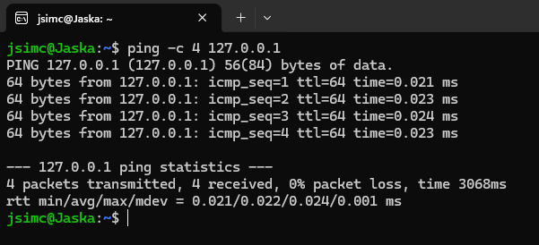
> 
>**Capture 2a – Résultat de la commande   `ping -c 4 127.0.0.1` sous WSL**
>
>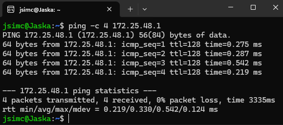
>
>**Capture 2b – Résultat de la commande   `ping -c 4 172.25.48.1` sous WSL**
>
> 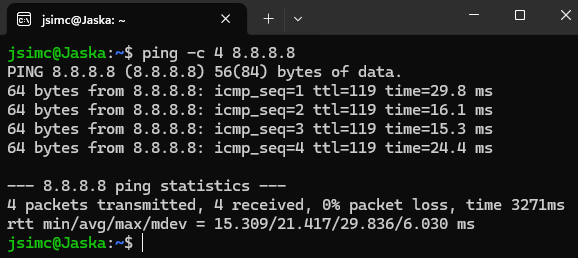
> 
>**Capture 2c – Résultat de la commande   `ping -c 4 8.8.8.8` sous WSL**

---

## Exercice 3 : Table ARP et résolution DNS (7 points)

### a) Table ARP

**Commande utilisée :** `arp`

**Nombre d'entrées :** 2

**Une entrée (IP et MAC) :** Jaska.mshome.net et 00:15:5d:74:ec:c1

### b) Requête DNS pour www.collegemaisonneuve.qc.ca

**Commande utilisée :** `nslookup www.collegemaisonneuve.qc.ca`

**Adresse IP obtenue :** Aucune, serveur ne trouve pas le NXDOMAIN.

### c) Commande `dig` pour github.com - TTL

**TTL (Time To Live) de l'enregistrement :** 41 secondes

> 📸 **Capture d'écran 3** : Insérez votre capture de la table ARP et d'une requête DNS
> 
> 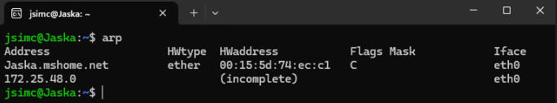
> 
> **Capture 3a – Résultat de la commande   `arp` sous WSL**
> 
>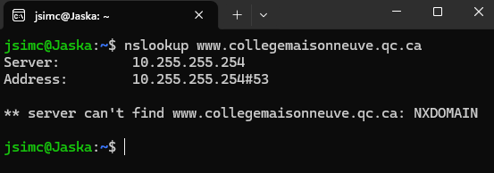
>
> **Capture 3b – Résultat de la commande   `nslookup www.collegemaisonneuve.qc.ca` sous WSL**
> 
>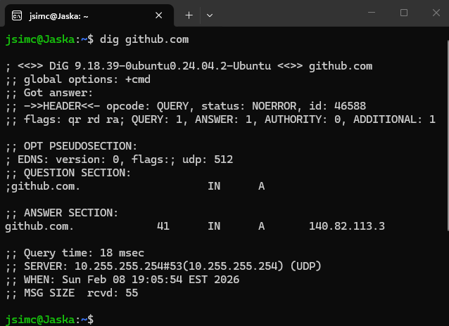
>
> **Capture 3c – Résultat de la commande   `dig github.com` sous WSL**

---

# Partie 3 : Analyse Wireshark (25 points)

## Exercice 4 : Capture et analyse ICMP (10 points)

### Analyse d'un paquet "Echo (ping) request"

| Information             | Valeur observée     |
| ----------------------- | ------------------- |
| Adresse MAC source      | `ac:19:8e:28:ce:36` |
| Adresse MAC destination | `88:9e:68:a1:d9:16` |
| Adresse IP source       | `10.0.0.177`        |
| Adresse IP destination  | `8.8.8.8`           |
| Type ICMP (numéro)      | 8                   |
| Code ICMP               | 0                   |

### Question : Différence entre le Type ICMP d'un "Echo Request" et d'un "Echo Reply" ?

```
Votre réponse : L'un envoie 


```

> 📸 **Capture d'écran 4** : Capture Wireshark montrant les paquets ICMP avec le détail d'un paquet
>
>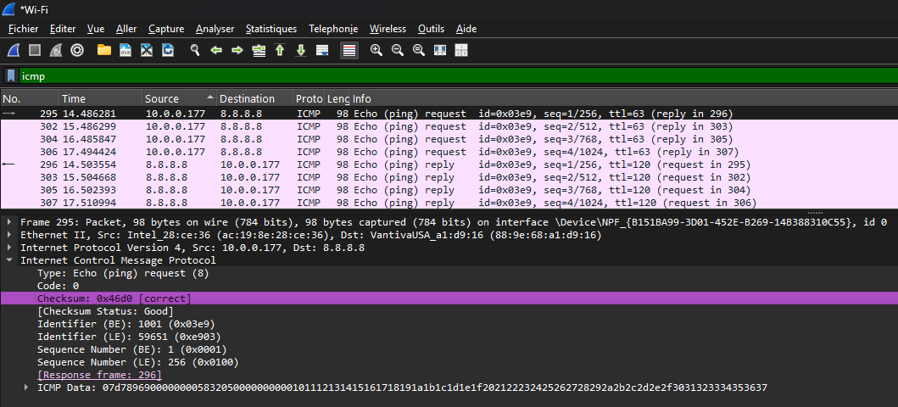
>
>**Capture 4 – Résultat du filtre ICMP dans l'application avec Wireshark lors d'un ping à l'adresse IP 8.8.8.8**

---

## Exercice 5 : Capture et analyse DNS (8 points)

### Analyse de la requête et réponse DNS

| Information                | Valeur observée |
| -------------------------- | --------------- |
| Port source (requête)      | 55073           |
| Port destination (requête) | 53              |
| Protocole de transport     | UDP             |
| Type de requête DNS        | A               |
| Adresse IP dans la réponse | 140.82.114.4    |

> 📸 **Capture d'écran 5** : Capture Wireshark montrant la requête et réponse DNS
>
>
>
> **Capture 5 – Résultat du filtre DNS dans l'application avec Wireshark  lors de la commande `nslookup www.github.com`**

---

## Exercice 6 : Capture et analyse ARP (7 points)

### Tableau d'un échange ARP observé

|Information|ARP Request|ARP Reply|
|---|---|---|
|Adresse MAC source|||
|Adresse MAC destination|||
|Adresse IP recherchée|||

### Question : Pourquoi l'adresse MAC de destination dans l'ARP Request est-elle `ff:ff:ff:ff:ff:ff` ?

```
Votre réponse : Parce que l'adresse MAC n'est pas connue, donc la requête ARP est envoyé en broadcast.
```

> 📸 **Capture d'écran 6** : Capture Wireshark montrant l'échange ARP

>
>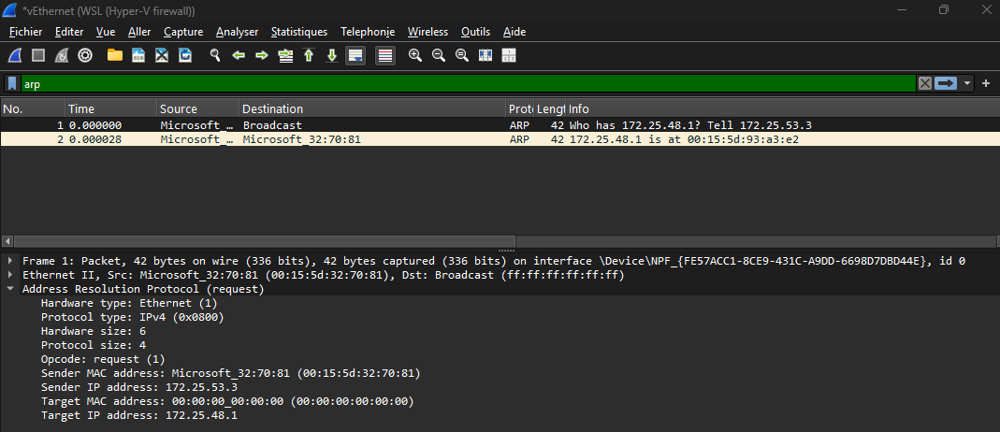
>
>**Capture 5 – Résultat du filtre ARP dans l'application avec Wireshark  lors de la commande ` ping-c 1 172.25.48.1`**

---

# Partie 4 : Script de diagnostic réseau (30 points)

## Exercice 7 : Création du script

### Informations sur votre script

**Nom du fichier :** `diagnostic_reseau.sh`

### Checklist des fonctionnalités implémentées

Cochez les fonctionnalités que vous avez implémentées :

- [ ] Affichage du nom de l'hôte
- [ ] Affichage de la date et heure
- [ ] Affichage de la version du système
- [ ] Affichage de l'adresse IP locale
- [ ] Affichage de l'adresse de la passerelle
- [ ] Affichage des serveurs DNS
- [ ] Test de connectivité localhost
- [ ] Test de connectivité passerelle
- [ ] Test de connectivité Internet (8.8.8.8)
- [ ] Test de résolution DNS (google.com)
- [ ] Affichage de la table ARP
- [ ] Résolution DNS de 2+ domaines
- [ ] Gestion des erreurs (messages si échec)
- [ ] Commentaires dans le code
- [ ] Affichage clair avec titres de sections

### Difficultés rencontrées (optionnel)

```
Décrivez ici les difficultés que vous avez rencontrées lors de la création du script :


```

> 📸 **Capture d'écran 7** : Capture montrant l'exécution de votre script
> 
> 

---

# Récapitulatif de la remise

## Fichiers à inclure dans votre projet

Vérifiez que votre projet contient :

- [ ] `reponse.md` (ce fichier complété)
- [ ] `diagnostic_reseau.sh` (votre script)
- [ ] `captures/capture1_config_reseau.png`
- [ ] `captures/capture2_ping.png`
- [ ] `captures/capture3_arp_dns.png`
- [ ] `captures/capture4_wireshark_icmp.png`
- [ ] `captures/capture5_wireshark_dns.png`
- [ ] `captures/capture6_wireshark_arp.png`
- [ ] `captures/capture7_script_execution.png`

---

---

_Bon travail !_